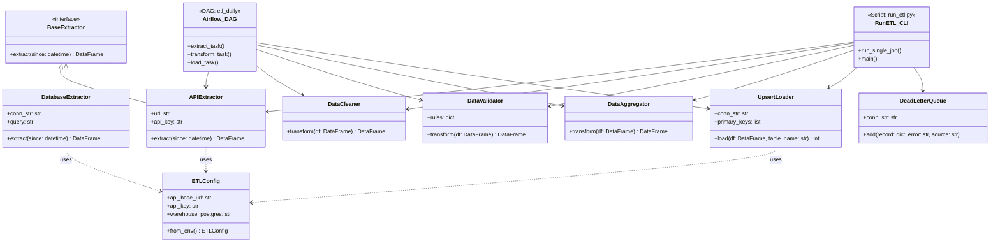
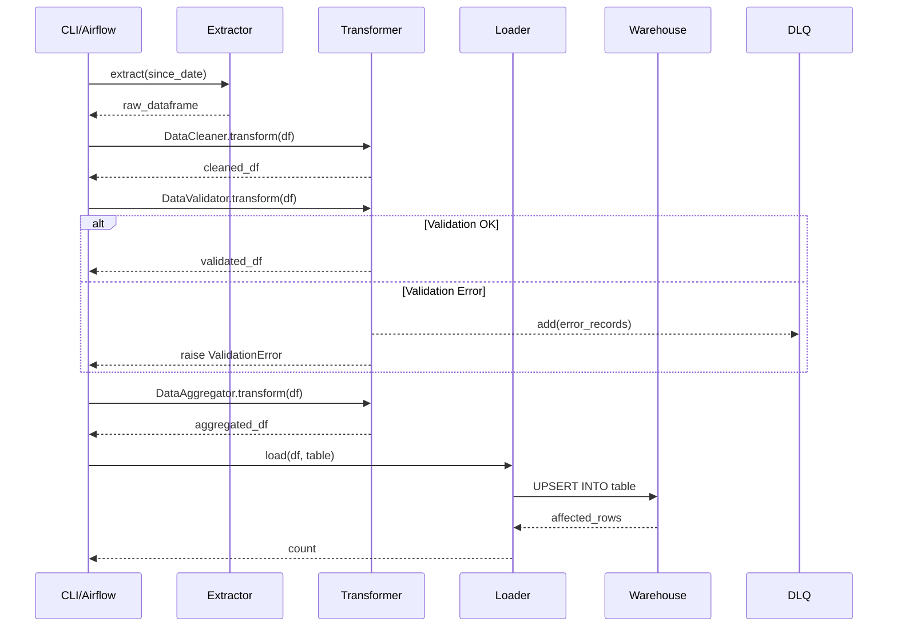

<!-- Experimental Badge -->

### ETL-Data-Pipeline

---

#### UML Diagrams of the ETL Project

This document contains a UML class diagram describing the structure of the project logic (excluding tests). The diagram shows how the various classes in `scripts/` are connected and how they are used by the two main entry points: the Airflow DAG and the CLI script.

#### Class Diagram (Structure)

#### Sequence Diagram (ETL Flow)

This diagram shows how data flows through the system during a job run (e.g., "orders").

### Component Descriptions:

1.  **Extractors (`scripts/extractors.py`):** Responsible for fetching data from sources (API or database).
2.  **Transformers (`scripts/transformers.py`):** Contains the "pure" business logic. This is where data is cleaned, validated, and aggregated.
3.  **Loaders (`scripts/loaders.py`):** Handles writing to the data warehouse. Uses `UPSERT` to avoid duplicates.
4.  **Error Handling (`error_handling.py`):** Contains `DeadLetterQueue` (DLQ) for saving records that fail validation, so they can be fixed later without stopping the entire pipeline.
5.  **Orchestration:**
    *   **Airflow DAG:** The modern, recommended method where each step is a separate task.
    *   **run_etl.py:** CLI tool that allows you to run the same logic manually for testing and development.

---

### Project Structure and File Descriptions

Below is an overview of the project's files and folders:

#### 📂 Root Directory
*   `error_handling.py`: Contains custom exceptions (`ValidationError`) and `DeadLetterQueue` logic for handling invalid data.
*   `pyproject.toml`: Configuration file for the Python project (e.g., tool settings).
*   `requirements.txt`: List of Python dependencies required to run the project.
*   `run_tests.sh`: A bash script that sets up the test database and runs the entire test suite.
*   `readme.md`: This file, documenting the project's architecture and files.

#### 📂 `config/`
*   `settings.py`: Handles environment variables and configuration (database strings, API keys, etc.) via the `ETLConfig` class.
*   `logging.py`: Central configuration for logging throughout the system.

#### 📂 `dags/`
*   `etl_daily.py`: The main Airflow DAG. Defines the pipeline as granular tasks (`extract`, `transform`, `load`).

#### 📂 `scripts/`
*   `extractors.py`: Contains classes for fetching data (`APIExtractor`, `DatabaseExtractor`, `MockAPIExtractor`).
*   `transformers.py`: Contains logic for cleaning (`DataCleaner`), validation (`DataValidator`), and aggregation (`DataAggregator`).
*   `loaders.py`: Contains `UpsertLoader` which handles efficient data loading to Postgres.
*   `monitoring.py`: Manages metrics (`ETLMetrics`) and notifications (e.g., Slack).
*   `utils.py`: Utility functions for saving raw data and archiving files.
*   `run_etl.py`: CLI entry point for running ETL jobs manually outside of Airflow.

#### 📂 `tests/`
*   `init_db.py`: Initializes the test database with the necessary tables.
*   `conftest.py`: Contains shared fixtures for pytest (e.g., mock data).
*   `test_dag.py`: Tests the Airflow DAG's structure and integrity.
*   `test_transformers.py`: Unit tests for the transformation logic.
*   `test_extractor.py`, `test_loaders.py`, `test_monitoring.py`, etc.: Specific tests for the project's various modules.
*   `test_data/`: Contains CSV files with sample data for testing.